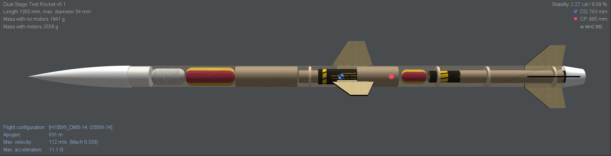

# Dual-Stage-Interceptor-V1
**Aerodynamic Optimization of a Two-Stage Sounding Rocket**

## 🚀 Project Overview
This repository contains the design, simulation data, and performance analysis for **Interceptor V1**, a high-power dual-stage rocket. The project involved a full engineering cycle—from initial airframe geometry to high-fidelity flight simulations—focusing on optimizing stability for a supersonic-transition flight profile.

### **Key Technical Achievements**
*   **Stability Tuning:** Iterated fin geometry to reduce static stability from an over-stable **3.79 cal** to a high-performance **2.27 cal**.
*   **Drag Reduction:** Integrated a **50mm boattail** and "sheared" fin profiles to minimize base drag and optimize the wake profile.
*   **Staged Propulsion:** Engineered a seamless transition from an **AeroTech I200W** booster to an **H100W** sustainer.

---

## 📊 Performance Metrics
| Metric | Value |
| :--- | :--- |
| **Peak Altitude (Apogee)** | **631 m** |
| **Maximum Velocity** | **112 m/s (Mach 0.33)** |
| **Max Acceleration** | **11.1 G** |
| **Stability Margin** | **2.27 cal** |

---

## 🛠️ Repository Structure
*   `design/`: Contains the `.ork` (OpenRocket) source file.
*   `renders/`: 3D Finished and X-Ray internal layout renders.
*   `analysis/`: Flight plots including Vertical Motion, Stability, Drag Coefficient, and Reynolds Number.
*   `docs/`: Formal **Engineering Design Report** (PDF/LaTeX).

---

## 📝 Engineering Summary
The **Interceptor V1** demonstrates the critical balance between raw power and aerodynamic necessity. By shifting the Center of Pressure through sweep optimization, the vehicle maintains a stable **2.02 cal** margin even after shedding the booster stage. This ensures a straight flight path and maximum energy conservation for high-altitude telemetry missions.

> **Note:** For a deep dive into the fluid dynamics and mass budget, please refer to the [Full Project Report](docs/Interceptor_Design_Report.pdf).

---
**Author:** Aayushman Das  
*Department of Electronics and Telecommunication Engineering, Jadavpur University*
